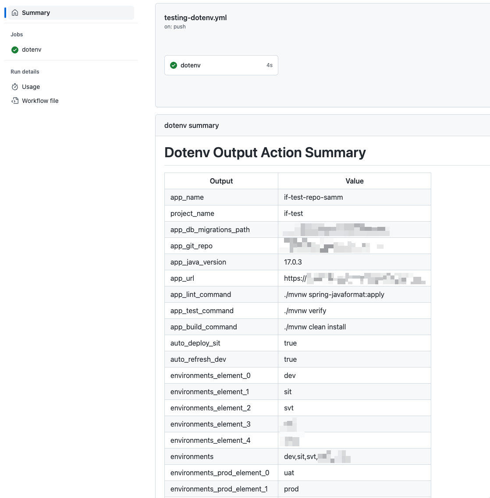

# dotenv output action

This Github Action reads items from provided environment file (`.env`) and provides outputs with their values.

## Build history

[](https://github.com/sammcj/dotenv-output-action/actions)

## Inputs

- `path` - Override the path to the `.env` file. Default is `.env` in the repository root.
- `log-variables` - Log variables after reading from the `.env` file and output a table to the workflow [summary](https://docs.github.com/en/actions/using-workflows/workflow-commands-for-github-actions#adding-a-job-summary) (default: `true`).
- `mask-variables` - [Mask](https://docs.github.com/en/actions/using-workflows/workflow-commands-for-github-actions#masking-a-value-in-log) values after reading from the `.env` file (default: `false`).

## Outputs

- `generic` - Whatever is present in the `.env` file will be converted into an output variable.

E.g. you have the following `.env`:

```yaml
  VERSION=1.0
  AUTHOR=Mickey Mouse
  MYARRAY=1,2,3
```

Then you will have outputs:

- `version`: `1.0`
- `author`: `Mickey Mouse`
- `myarray`: `1,2,3`
- `myarray_element_0`: `1`
- `myarray_element_1`: `2`
- `myarray_element_2`: `3`

## Example usage

Assuming the following .env file:

```.env
hello=world
```

```yaml
- name: dotenv
  id: dotenv
  uses: sammcj/dotenv-output-action@main

- name: echo hello world
  run: echo "hello ${{ steps.dotenv.outputs.hello }}"
  # Will output "Hello world"
```

Full example:

```yaml
- name: dotenv
  id: dotenv
  uses: sammcj/dotenv-output-action@main
  with:
    path: .github/.github.env
    log-variables: true
    mask-variables: false
```

## Screenshot



## Credits

- Originally forked from [falti/dotenv-action](https://github.com/falti/dotenv-action)
